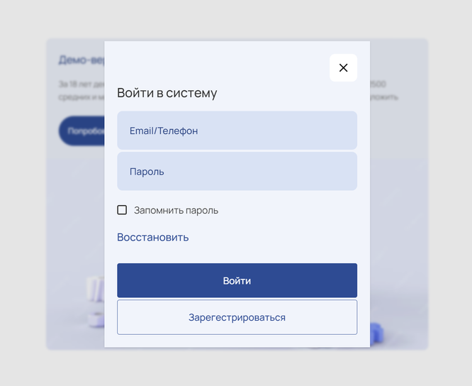

# Webernetic Test Project

## Description

The layout starts with an animated sign-in **Modal** window and later shows the **Responsive Component**.

**Modal** is a `dialog` component, hence it can be closed with `ESC`. Or just click the "cross" closing button, the form buttons or the anchor. 
The **sign-in**, **sign-up** or **restore** options are not implemented yet - will be added on request. The repsective buttons and the anchor can also close the modal. 

**Responsive Somponent** changes it's outfit according to breakpoints from the task requirements. Change the viewport width to see transformations.

## Execution

1. Run `index.html` on Live Server locally. 
   &ensp;or
2. Visit **[the deployed](https://webernetic.mirzaianov.com/)** version.

## Authors

@mirzaianov

## Version History

- 1.0.0 First Release
